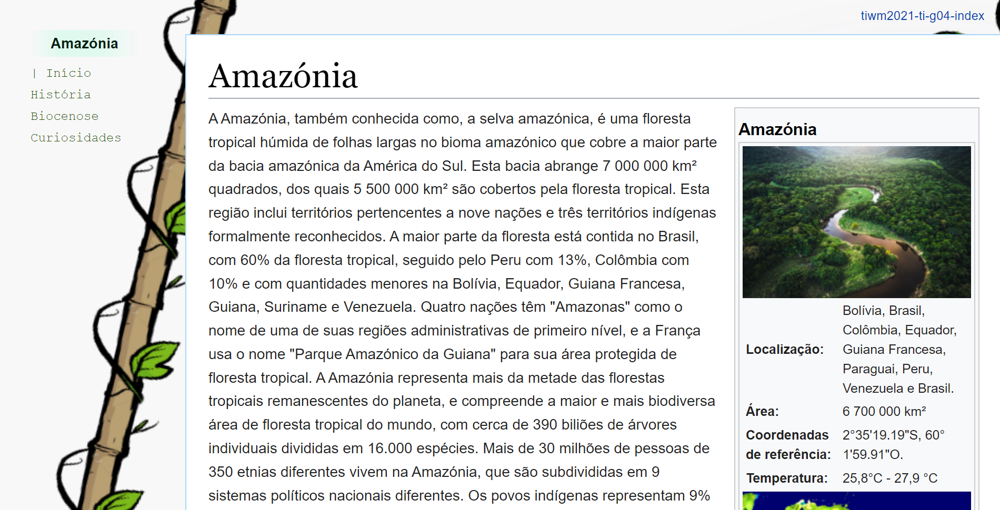

# My work assignment Title

Repository to host the project developed for 'some class', a fisrt year subject at SOMESCHOOL. Developed by Group 04 : [@JoaoGoncalves](https://github.com/joaogoncalves7), [@BrunoAlmeida](https://github.com/TheHike), [@SimaoCoroa](https://github.com/SimaoCoroa).

## Short theme description

An example report using markdown on Github. This documentation is writen using [Markdown](https://www.markdownguide.org/). Here is a [link to the basic syntax](https://www.markdownguide.org/basic-syntax), but an [extended syntax](https://www.markdownguide.org/extended-syntax/) is also available. If you're starting with Markdown, you may want to try a [Markdown Tutorial](https://www.markdowntutorial.com/) and read the [getting started](https://www.markdownguide.org/getting-started/) section.

## Repository organization

* **Source code** is in the [src folder](src/).
* Report chapters are in [doc folder](doc/).

## Gallery

Home page header            |  Home page footer 
:-------------------------:|:-------------------------:
  |  

## Technologies

_Indicate the technologies you have used in this assignment. Please provide links for the user to read more about those technologies._
* XML
* HTML5 + CSS3
* Javascript
* JQuery

### Frameworks and Libraries

* JQuery

## Report
### Project presentation
* Chapter 1: [Project presentation](doc/c1.md)
### User Interface 
* Chapter 2: [User Interface Prototype and Sitemap](doc/c2.md)
### Product
* Chapter 3: [Product](doc/c3.md)
### Presentation
* Chapter 4: [Presentation](doc/c4.md)

## Team
* João Gonçalves [@JoaoGoncalves](https://github.com/joaogoncalves7)
* Bruno Almeida [@BrunoAlmeida](https://github.com/TheHike)
* Simão Coroa [@SimaoCoroa](https://github.com/SimaoCoroa)
