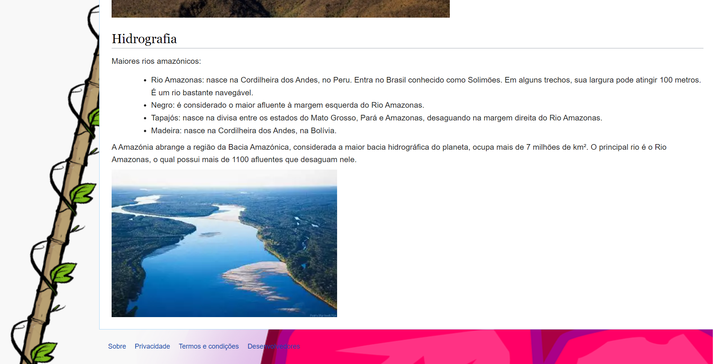
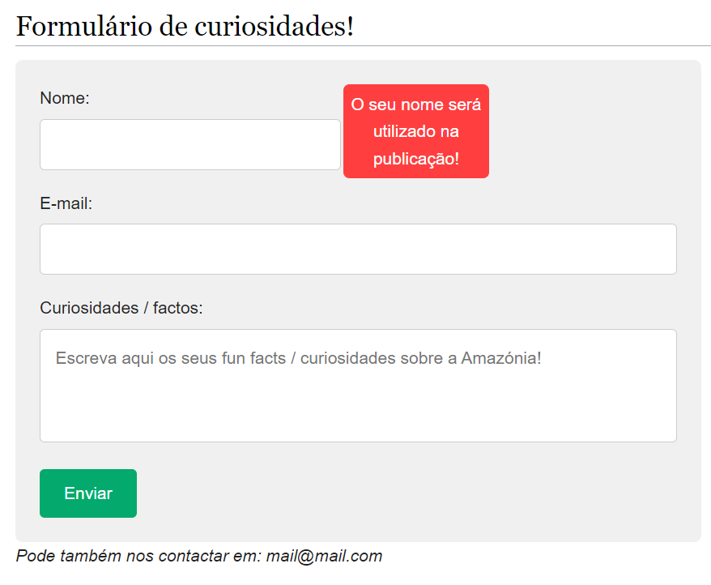
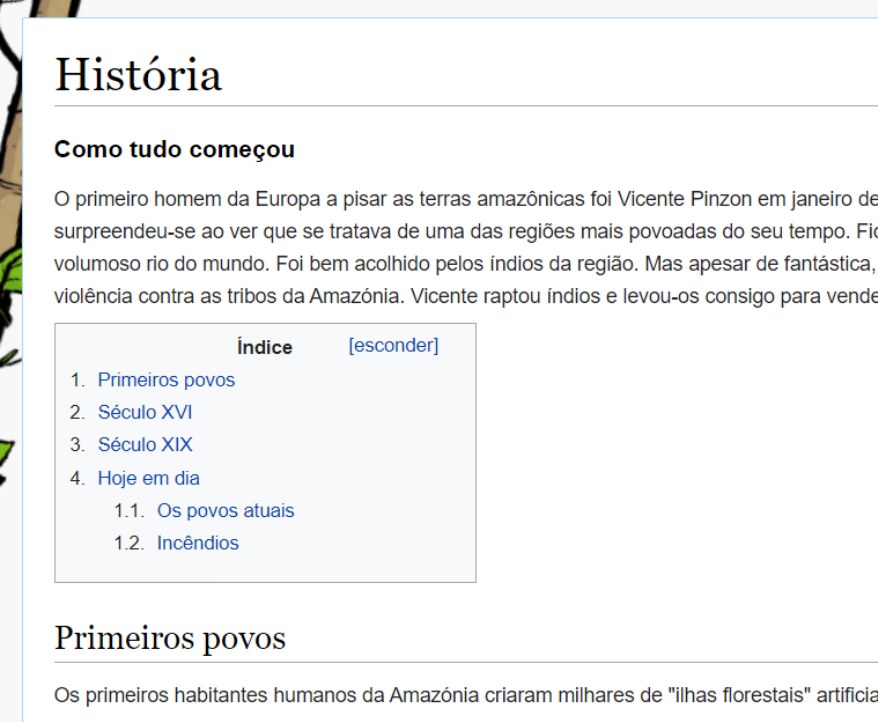

# Amazon rainforest

Repository to host the project developed for Tecnologias Internet, a first year subject at Instituto Politécnico da Maia. Developed by Group 04 : [@JoaoGoncalves](https://github.com/joaogoncalves7), [@BrunoAlmeida](https://github.com/TheHike), [@SimaoCoroa](https://github.com/SimaoCoroa).

## Short theme description

Our project work will address the theme: Forests, more specifically the Amazon rainforest, the largest in the world. We aim to not only talk about recent events related to deforestation, but also its history, biome and other curiosities.

## Repository organization

* **Source code** is in the [src folder](src/).
* Report chapters are in [doc folder](doc/).

## Gallery

Home page header            |  Home page footer 
:-------------------------:|:-------------------------:
  |  

Fact form            |  History page
:-------------------------:|:-------------------------:
  |  

## Technologies

* XML
* HTML5 + CSS3
* Javascript

## Report
### Project presentation
* Chapter 1: [Project presentation](doc/c1.md)
### User Interface 
* Chapter 2: [User Interface Prototype and Sitemap](doc/c2.md)
### Product
* Chapter 3: [Product](doc/c3.md)
### Presentation
* Chapter 4: [Presentation](doc/c4.md)

## Team
* João Gonçalves [@JoaoGoncalves](https://github.com/joaogoncalves7)
* Bruno Almeida [@BrunoAlmeida](https://github.com/TheHike)
* Simão Coroa [@SimaoCoroa](https://github.com/SimaoCoroa)
