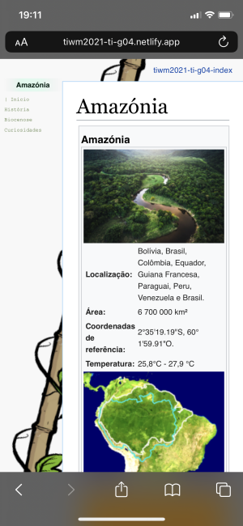
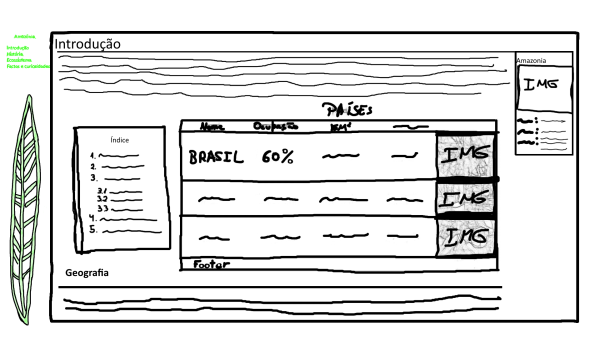
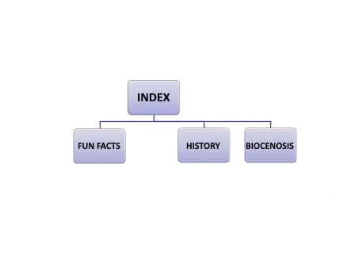

# C2 : User Interface

Our responsive interface supports multiple resolutions and is very mobile friendly. The way we pulled this off was by shifting every page element to the center of the screen the closer we get.

By tapping the menu on the left, we get to travel between pages.

| |
:---:
 |
Mobile screenshot |

## Interface and Common features

### Sketchs

| |
:---:
 |
Main page sketch |

### Wireframes

| |
:---:
 |
Main wireframe |

---
[< Previous](c1.md) | [^ Main](../../../) | [Next >](c3.md)
:--- | :---: | ---: 
