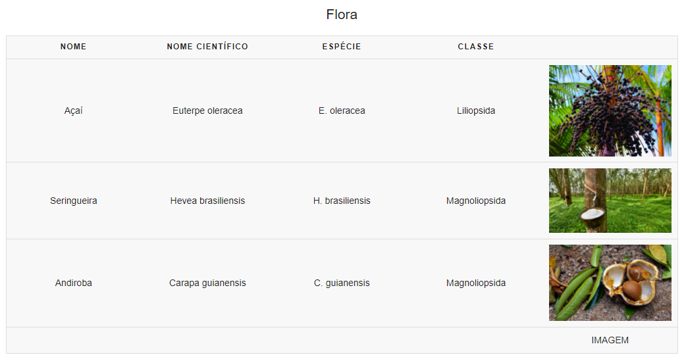

# C3 : Product

This product is a responsive informative website about the Amazon Rainforest

Live version can be found at our [netlify page](https://tiwm2021-ti-g04.netlify.app/)

## 3.1 Instalation

To install our project in your machine, you must download XAMPP and execute it, after that just run the Apache service by hitting "Start".
When that is done, you must place of our src folder from this repository in the following path "C:\xampp\htdocs".
Finally, you enter this address in your favorite web browser: http://localhost/src/

If you don't want to run anything locally on your machine, you can just create an account over at [netlify](www.netlify.com) and when you're done, simply drag the files inside src (from this repository) and place them in the upload box at netlify.
From there you will see a website link that should look something like this: "generated_name.netlify.app/" and just press the link to open it.

## 3.2 Usage

There is no backend code running so there is not method of user authentication, you're free to browse our website.

## 3.3 Application/Product help

The side menu is pretty self explanatory, the user just needs to press any of the sections and the website forwards you.
There is one little tooltip when you're filling the "Fun facts" form, which tells you that your name information maybe be used by us in the future.

| |
:---:
 |
Form tooltip |

## 3.4 Forms

The same form we mentioned before is validating the users input, it is required to input a correct e-mail and to fill every input field.

| | |
:---: | :---:
 | 
Invalid email |  Empty input field

## 3.5 HTML5 and CSS3 validation

_Describe the method used to validate HTML and CSS. Don't forget to add details about the used validators. Show the validation results._
_Add images, tables or reports of the tests performed._

For validation we used the W3C HTML5 and CSS3 validators.

Validator information from [W3C](https://validator.w3.org/): 
> This validator checks the markup validity of Web documents in HTML, XHTML, SMIL, MathML, etc. If you wish to validate specific content such as RSS/Atom feeds or CSS stylesheets, MobileOK content, or to find broken links, there are other validators and tools available. As an alternative you can also try our non-DTD-based validator.

Our validation results for HTML5

| |
:---:
 |
HMLT5 Results |

Our validation results for CSS3

| |
:---:
 |
CSS3 Results |

## 3.6 Implementation details

### HTML Requirements

#### Table

A complete table (as requested) can be found [here](https://github.com/TI-04/-tiwm2021-ti-g04/blob/main/src/biocenose.html#L54)

| |
:---:
 |
Table preview |

#### Lists

Unordered and nested list can be found [here](https://github.com/TI-04/-tiwm2021-ti-g04/blob/main/src/index.html#L79)
Ordered list can be found [here](https://github.com/TI-04/-tiwm2021-ti-g04/blob/main/src/curiosidades.html#L46)

#### Usage of text highlight elements

Modified strong tag can be found [here](https://github.com/TI-04/-tiwm2021-ti-g04/blob/main/src/biocenose.html#L42)

[CSS](https://github.com/TI-04/-tiwm2021-ti-g04/blob/main/src/style.css#L83)

#### Images and figure + CSS insertion

[Image](https://github.com/TI-04/-tiwm2021-ti-g04/blob/main/src/historia.html#L82)

[Figure with caption](https://github.com/TI-04/-tiwm2021-ti-g04/blob/main/src/historia.html#L37)

[Image from css](https://github.com/TI-04/-tiwm2021-ti-g04/blob/main/src/curiosidades.html#L75)

[CSS](https://github.com/TI-04/-tiwm2021-ti-g04/blob/main/src/style.css#L649)

[CSS 2](https://github.com/TI-04/-tiwm2021-ti-g04/blob/main/src/style.css#L12)

#### Hyperlinks (internal + external)

[Internal hyperlink](https://github.com/TI-04/-tiwm2021-ti-g04/blob/main/src/index.html#L16)

[External hyperlink](https://github.com/TI-04/-tiwm2021-ti-g04/blob/main/src/index.html#L29)

#### Form

[Fun facts form](https://github.com/TI-04/-tiwm2021-ti-g04/blob/main/src/curiosidades.html#L90)

### CSS Requirements

---
[< Previous](c2.md) | [^ Main](../../../) | [Next >](c4.md)
:--- | :---: | ---: 
