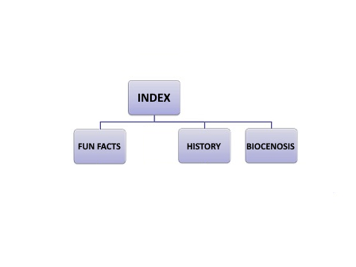
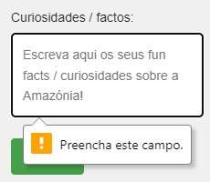
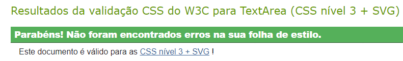
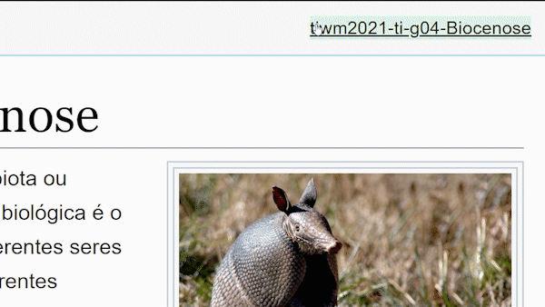

# C1 : The Amazon rainforest

> O objetivo do trabalho prático é expor e avaliar os alunos perante uma situação de trabalho em
grupo, aplicação dos conhecimentos adquiridos, auto-aprendizagem, pesquisa e demonstração das
competências adquiridas.
Pretende-se que cada grupo desenvolva um conjunto de pelo menos quatro páginas estáticas,
criando um sítio Web com recurso a HTML5, CSS3, JavaScript e XML.

## Description

In our webpage you're gonna find information about the Amazon rainforest and you will get to know more about it. We're also taking fun facts from any reader that is willing to submit any. 

## Group 04

* João Gonçalves [@JoaoGoncalves](https://github.com/joaogoncalves7)
* Bruno Almeida [@BrunoAlmeida](https://github.com/TheHike)
* Simão Coroa [@SimaoCoroa](https://github.com/SimaoCoroa)

# C2 : User Interface

Our responsive interface supports multiple resolutions and is very mobile friendly. The way we pulled this off was by shifting every page element to the center of the screen the closer we get.

By tapping the menu on the left, we get to travel between pages.

| |
:---:
 |
Mobile screenshot |

## Interface and Common features

### Sketchs

| |
:---:
 |
Main page sketch |

### Wireframes

| |
:---:
 |
Main wireframe |

# C3 : Product

This product is a responsive informative website about the Amazon Rainforest

Live version can be found at our [netlify page](https://tiwm2021-ti-g04.netlify.app/)

## 3.1 Instalation

To install our project in your machine, you must download XAMPP and execute it, after that just run the Apache service by hitting "Start".
When that is done, you must place our "src" folder from this repository in the following path "C:\xampp\htdocs".
Finally, you enter [this](http://localhost/src/) address in your favorite web browser and you should be able to view the website.

If you don't want to run anything locally in your machine, you can just create an account over at [netlify](https://www.netlify.com) and when you're done, simply drag the "src" folder (from this repository) and place it in the upload box at netlify.

When you're done uploading, you should be able to see a website link that looks something like this: "generated_name.netlify.app/"

To open it, just press the mentioned link.

## 3.2 Usage

There is no backend code running so there is not method of user authentication, you can browse our pages freely.

## 3.3 Application/Product help

The side menu is pretty self explanatory, the user just needs to press any of the side tab links and the website forwards you.

There is one little tooltip when you're filling the "Fun facts" form, which tells you that your name information maybe be used by us in the future.

| |
:---:
 |
Form tooltip |

## 3.4 Forms

The same form we mentioned before is validating the users input, it is required to input a correct e-mail and to fill every input field.

| | |
:---: | :---:
 | 
Invalid email |  Empty input field

## 3.5 HTML5 and CSS3 validation

For validation we used the W3C HTML5 and CSS3 validators.

Validator information from [W3C](https://validator.w3.org/): 
> This validator checks the markup validity of Web documents in HTML, XHTML, SMIL, MathML, etc. If you wish to validate specific content such as RSS/Atom feeds or CSS stylesheets, MobileOK content, or to find broken links, there are other validators and tools available. As an alternative you can also try our non-DTD-based validator.

| |
:---:
 |
HMLT5 Results |

| |
:---:
 |
CSS3 Results |

## 3.6 Implementation details

### HTML Requirements

#### Table

A complete table (as requested) can be found [here](https://github.com/TI-04/-tiwm2021-ti-g04/blob/main/src/biocenose.html#L54)

| |
:---:
 |
Table preview |

#### Lists

Unordered and nested list can be found [here](https://github.com/TI-04/-tiwm2021-ti-g04/blob/main/src/index.html#L79)
Ordered list can be found [here](https://github.com/TI-04/-tiwm2021-ti-g04/blob/main/src/curiosidades.html#L46)

#### Usage of text highlight elements

Modified strong tag can be found [here](https://github.com/TI-04/-tiwm2021-ti-g04/blob/main/src/biocenose.html#L42)

[CSS](https://github.com/TI-04/-tiwm2021-ti-g04/blob/main/src/style.css#L83)

#### Images and figure + CSS insertion

[Image](https://github.com/TI-04/-tiwm2021-ti-g04/blob/main/src/historia.html#L82)

[Figure with caption](https://github.com/TI-04/-tiwm2021-ti-g04/blob/main/src/historia.html#L37)

[Image from css](https://github.com/TI-04/-tiwm2021-ti-g04/blob/main/src/curiosidades.html#L75)

[CSS](https://github.com/TI-04/-tiwm2021-ti-g04/blob/main/src/style.css#L649)

[CSS 2](https://github.com/TI-04/-tiwm2021-ti-g04/blob/main/src/style.css#L12)

#### Hyperlinks (internal + external)

[Internal hyperlink](https://github.com/TI-04/-tiwm2021-ti-g04/blob/main/src/index.html#L16)

[External hyperlink](https://github.com/TI-04/-tiwm2021-ti-g04/blob/main/src/index.html#L29)

#### Form

[Fun facts form](https://github.com/TI-04/-tiwm2021-ti-g04/blob/main/src/curiosidades.html#L90)

### CSS Requirements

#### Every simple selector and pseudo-elements + combinator

There are too many of these in our stylesheet to cover them all, instead press [here](https://github.com/TI-04/-tiwm2021-ti-g04/blob/main/src/style.css) and hit [CTRL] + [F] to find them.

#### Text and font properties

[Font family](https://github.com/TI-04/-tiwm2021-ti-g04/blob/main/src/style.css#L2)

[Font size](https://github.com/TI-04/-tiwm2021-ti-g04/blob/main/src/style.css#L6)

#### Background color and image

[Background-image](https://github.com/TI-04/-tiwm2021-ti-g04/blob/main/src/style.css#L12)

[Background-color](https://github.com/TI-04/-tiwm2021-ti-g04/blob/main/src/style.css#L15)

#### List styling

[Unordered list style](https://github.com/TI-04/-tiwm2021-ti-g04/blob/main/src/style.css#L226)

#### Float & Position

[Float and position](https://github.com/TI-04/-tiwm2021-ti-g04/blob/main/src/style.css#L260)

#### Hide and element

[Hidden element](https://github.com/TI-04/-tiwm2021-ti-g04/blob/main/src/style.css#L516)

#### Table styling

[Table at css](https://github.com/TI-04/-tiwm2021-ti-g04/blob/main/src/style.css#L472)

#### Image over element

[Div to image](https://github.com/TI-04/-tiwm2021-ti-g04/blob/main/src/style.css#L649)

#### Responsiveness

[Media queries usage (550px)](https://github.com/TI-04/-tiwm2021-ti-g04/blob/main/src/style.css#L449)

[Media queries usage (900px)](https://github.com/TI-04/-tiwm2021-ti-g04/blob/main/src/style.css#L525)

### XML Integration

The page reads information stored in a xml file and export it to html with JavaScript

After that we create a table with the help of JavaScript.

[JavaScript](https://github.com/TI-04/-tiwm2021-ti-g04/blob/main/src/biocenose.html#L132)

[HTML5](https://github.com/TI-04/-tiwm2021-ti-g04/blob/main/src/biocenose.html#L105)

[XML](https://github.com/TI-04/-tiwm2021-ti-g04/blob/75100d2d283e0797eaf8c9bba6c2ae45c5dd90e1/src/xml/animals.xml)

[XSD](https://github.com/TI-04/-tiwm2021-ti-g04/blob/75100d2d283e0797eaf8c9bba6c2ae45c5dd90e1/src/xml/animals.xsd)

### JavaScript

#### Hide and show elements

[Show](https://github.com/TI-04/-tiwm2021-ti-g04/blob/main/src/javascript.js#L11)

[Hide](https://github.com/TI-04/-tiwm2021-ti-g04/blob/main/src/javascript.js#L17)

#### Mouse hover effect with timings

[JavaScript](https://github.com/TI-04/-tiwm2021-ti-g04/blob/main/src/javascript.js#L32)

[HTML5](https://github.com/TI-04/-tiwm2021-ti-g04/blob/75100d2d283e0797eaf8c9bba6c2ae45c5dd90e1/src/curiosidades.html#L28)

| |
:---:
 |
JS preview |

# C4 : Presentation

[Youtube](https://www.youtube.com/channel/UCdlsU_3-p4AXzsa_Fco8iQw)